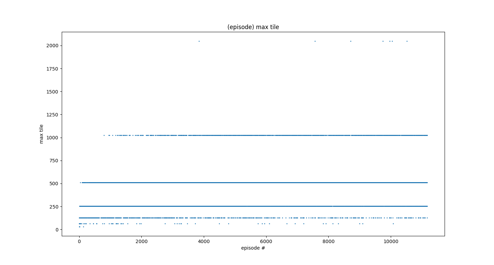
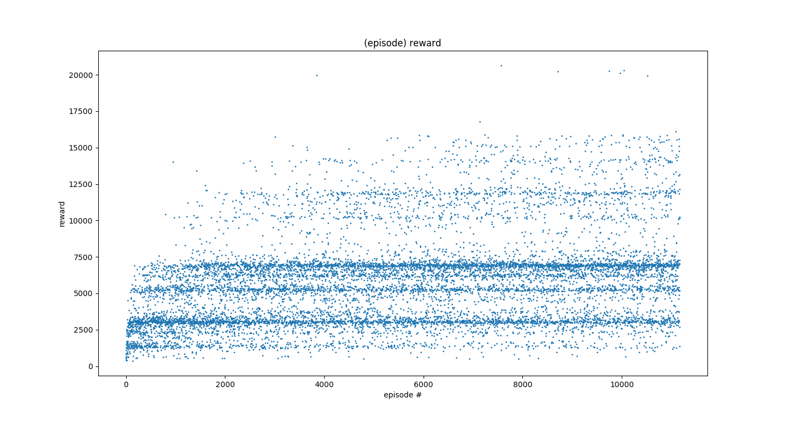
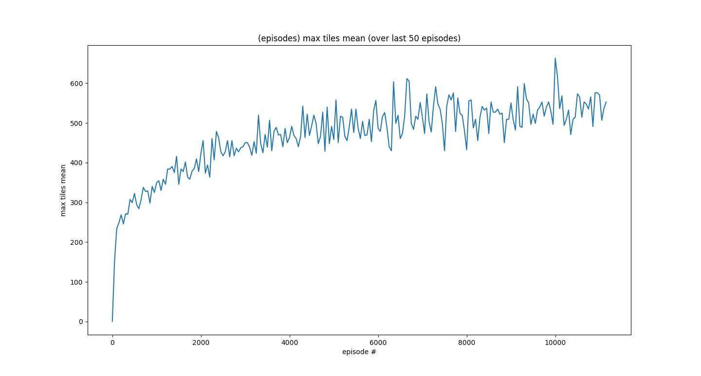
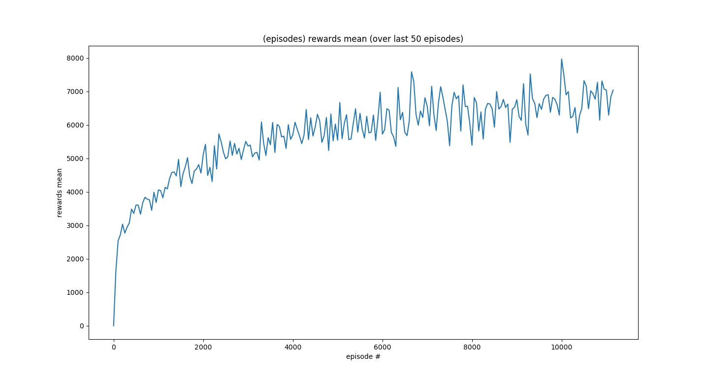

# Deep Reinforcement Learning to Play 2048 (with Keras)

Implementation of **deep Q-network** (**reinforcement learning** with **deep neural networks** and **convolutional neural networks**) to play the **game 2048** using Keras, Keras-RL and OpenAI Gym.

# Project Description
In this project I have implemented an [intelligent agent](https://en.wikipedia.org/wiki/Intelligent_agent) to play the [game 2048](https://gabrielecirulli.github.io/2048/). In particular I have used a **reinforcement learning** approach (**Q-learning**) with different types of **deep learning** models (a **deep neural network** and 2 types of **convolutional neural networks**) to model the action-value function, i.e., to learn the control policies (movements on the 2048 grid) directly from the environment state (represented by the 2048 grid).\
The resulting model goes by the name of **deep Q-network (DQN)** and has been made popular by the papers [[1]](http://arxiv.org/abs/1312.5602), [[2]](https://www.nature.com/articles/nature14236).

I haven't tested **recurrent neural networks** given that the game is fully observable hence using past history is probably useless. Moreover I haven't supervised the NN with well known [methods to solve the 2048 game like *expectimax optimization*](https://stackoverflow.com/questions/22342854/what-is-the-optimal-algorithm-for-the-game-2048). This because if we use an expectimax optimization approach NNs are not needed at all. Instead I preferred to use a pure AI approach where the NN learns by itself.

I have also tried few data pre-processing techniques (**log2 normalization** and **one-hot encoding**) and I presented the NNs with different data as input. I have obtained the best results by showing to the network input all the possible states of the game-matrix in the next 2 steps (I have got this intuition from the **Monte Carlo Tree Search** method used in the **AlphaGo Zero** model of **Deep Mind**).

I have implemented everything in Python using few libraries, in particular Keras with TensorFlow backend, Keras-RL, and a [Python implementation of the game 2048](https://github.com/rgal/gym-2048) which uses the OpenAI Gym framework.

I have also written few functions to **monitor the NN training in real-time** (similarly to what is done by TensorBoard with TensorFlow) given that the model takes a good amount of time to improve via training and having a direct feedback is a good way to cut short the training of unpromising network architectures. These functions have been implemented as Keras/Keras-RL callback functions (file **callbacks2048.py**).

Here are some figures showing how the models keeps improving as the training goes on. The charts have been produced by running 5,000,000 training steps (variable **NB_STEPS_TRAINING** in **dqn2048.py**), which required few days on my MacBook. I expect a substantial improvement by training the model for a multiple of this number of training steps.

- **Fig1**: max tile obtained on each game/episode as the NN training proceeds. Here we see how we obtain in sequence more games ending with 256, 512 then 1024 and some games ending with 2048.


- **Fig2**: score-reward obtained on each game/episode as the NN training proceeds. This is similar to Fig1, the difference is that here we look at the game-score and not the max tile reached.


- **Fig3**: evolution of the average max tile (average over 50 games/episodes) obtained as the NN training proceeds. This curve is slowly increasing meaning that the NN is still learning as the time goes on.


- **Fig4**: evolution of the average score-reward (average over 50 games/episodes) obtained as the NN training proceeds. This curve is rather similar to the one in Fig3.


# Repository Structure
+ **_game2048.py_**: module with game logic of 2048 (using [OpenAI Gym](https://gym.openai.com/) interface)
+ **_dqn2048.py_**: main script to train and/or test the deep Q-network (DQN) containing also the definitions of the deep learning models
+ **_processors2048.py_**: module with the pre-processors (one-hot encoding and log2 normalization) for the deep learning models' inputs
+ **_callbacks2048.py_**: module with Keras-RL callbacks used to monitor in real-time (via charts similar to the ones shown above) and log (in a CSV file) the NN training

# Installing & Running
## Requirements
This project requires:

+ Python (tests executed on Python 3.6)
+ Numpy
+ TensorFlow
+ Keras
+ [Keras-RL](https://github.com/keras-rl/keras-rl)
+ Gym ([OpenAI Gym](https://gym.openai.com/))
+ Matplotlib

## Installing

Before executing the script _dqn2048.py_ to train/test the DQN model we need to install Anaconda and some Python libraries, and clone this repo.
Here are all the detailed steps:

1. **Install Anaconda** (free and open source Python distribution): [https://conda.io/docs/user-guide/install/index.html]()
1. **Create a Python virtual environment** (it's a kind of Python sandbox where to experiment without interfering with other Python programs/libraries) and activate it from terminal. In particular the Python version chosen for the virtual environment must be compatible with TensorFlow (e.g., Python 3.6.0):
    ```
    conda create -n python360_virtenv python=3.6.0 anaconda
    source activate python360_virtenv
    ```
1. **Clone this GitHub repository** on your computer and move to the folder containing the files:
    ```
    git clone https://github.com/sergioiommi/DQN-2048.git
    cd DQN-2048
    ```
1. **Install the required Python libraries**:
    1. **Install TensorFlow** (in my case I have tested it under macOS 10.11 so I have installed TensorFlow 1.9.0 instead of 1.10.0 for compatibility issues):
        ```
        sudo pip install --upgrade https://storage.googleapis.com/tensorflow/mac/cpu/tensorflow-1.9.0-py3-none-any.whl
        ```
        If you have a different OS check the TensorFlow website: [https://www.tensorflow.org/install/]()
    1. **Install Keras and other libraries** (keras-rl, gym, matplotlib) listed in this repo's _requirements.txt_ file:
        ```
        sudo pip install -r requirements.txt
        ```

## Running (Training/Testing)
The Python script _dqn2048.py_ is already set for training the deep learning models for 5,000,000 steps (it required more that 2 days to complete the training on my MacBook) but you can change the script and move to a testing phase instead and use the weights I have already trained.\
Here are the instructions, respectively:

- **Train the models** (via Terminal):
    1. **Empty data folder**:
        - Make sure that the data folder with path ```/path/to/DQN-2048/data``` is empty, otherwise the script will try to load a pre-existing model.
    1. **Modify dqn2048.py:**
        - Open **dqn2048.py** with a text editor or an IDE (I normally use Eclipse with PyDev or Atom but I guess you have your own preference) and modify the variable **NB_STEPS_TRAINING** to 100,000 or something smaller and save it (if you want to modify other variables and the models' hyperparameters go ahead). You will not obtain great results with only 100,000 training steps, this will only get you started. You can increase such number well beyond my 5,000,000 attempt but it will require some time (depending on the hardware you have available).
    1. **Execute dqn2048.py:**
        - If you are following this step right after having executed the **Installing** steps (check above) I assume that you still have your Python virtual environment activated in the Terminal and you moved to the folder containing the files, hence you can simply execute the script:
        ```
        python dqn2048.py
        ```
        - Otherwise you need to activate the Python virtual environment we previously created and move to the folder containing the Python script. After that you can execute the script (all done via Terminal):
        ```
        source activate python360_virtenv
        cd DQN-2048
        python dqn2048.py
        ```

- **Test the models** (via Terminal):
    - If you want to see how the model performs in simulated games you can test it using the weights I have already trained (with 5,000,000 training steps) by doing the following:
    1. **Move the weights file:**
        - Copy the weights' file named **dqn_2048_dnn_onehot2steps_weights.h5f** from the folder ```/path/to/DQN-2048/data/DNN_3L_OneHot2Steps_5,000,000``` to ```/path/to/DQN-2048/data/``` that is monitored by the script.
    1. **Modify dqn2048.py:**
        - Open **dqn2048.py** with a text editor and modify the variable **TRAIN_TEST_MODE** to 'test'.
    1. **Execute dqn2048.py:**
        - (If not already done) activate the Python virtual environment previously created and move to the folder containing the Python script. After that you can execute the script (all done via Terminal):
        ```
        source activate python360_virtenv
        cd DQN-2048
        python dqn2048.py
        ```
# To Do

- **Train the models for a multiple of 5,000,000 training steps**
- **Save the model's optimizer/training state** to be able to resume the training without losing information:
    - This has been already partially implemented but I have to solve the error "TypeError: can't pickle _thread.RLock objects"
    - Read the description in the file _dqn2048.py_ with title "SAVING MODEL'S OPTIMIZER/TRAINING STATE"
- **Provide future n environment states (game grids) to the NN input**:
    - Right now the one-hot encoding pre-processing step contemplates only the case where it provides, as an input to the NNs, all and only the grids representing the board-matrices of the game in the next 2 steps (i.e., we provide 4+4*4=20 grids as an input to the NNs).
    - It would be interesting to implement a more general pre-processing framework where it is possible to specify the number of future steps of the game for which we want to calculate the board-matrices and give all these as an input to the NNs.
    - This should be done for both the pre-processing methods, one-hot encoding and log2 normalization.
    - Read the description in the file _processors2048.py_ with title "POSSIBLE IMPROVEMENT"
- **Add Monte Carlo Tree Search method:**
    - Similarly to what has been done in the **AlphaGo Zero** model
    - I expect this to increase the model performance substantially given that I have already observed an improvement in the results by providing more and more information regarding the future states of the game (next 1 or next 2 steps).

# Authors

- **Sergio Iommi** (sergio.iommi@gmail.com)

# References
1. *Playing Atari with Deep Reinforcement Learning*, Mnih et al., 2013
2. *Human-level control through deep reinforcement learning*, Mnih et al., 2015
3. [https://gabrielecirulli.github.io/2048/](https://gabrielecirulli.github.io/2048/)
